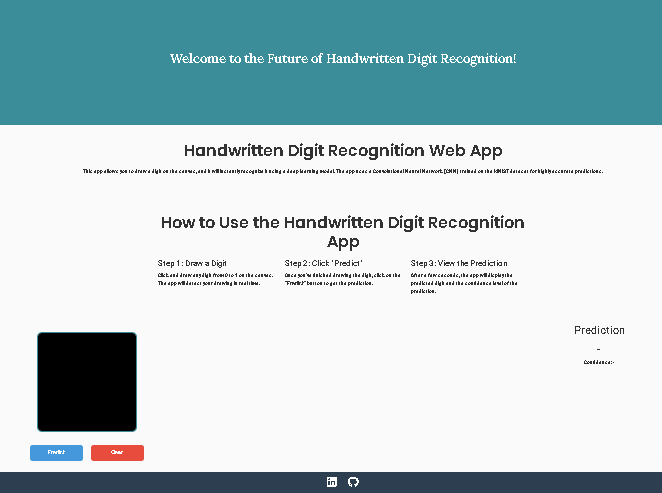

# Handwritten Digit Recognition Using Convolutional Neural Network (CNN)

Welcome to the Handwritten Digit Recognition project! This project uses a Convolutional Neural Network (CNN) model trained on the MNIST dataset to recognize handwritten digits (0-9) from user inputs. This application provides a simple web interface where users can draw a digit, and the model will predict the number with high accuracy.

Web App Link: https://itzdineshx.github.io/Handwritten-Digit-Recognition-system/



## Table of Contents
- [Project Overview](#project-overview)
- [Implemtation and demo](#implementation-demo)
- [Features](#features)
- [Project Structure](#project-structure)
- [Installation](#installation)
- [Usage](#usage)
- [How the Model Works](#how-the-model-works)
- [Future Applications](#future-applications)
- [Contributing](#contributing)
- [License](#license)

---

## Project Overview

This project leverages a CNN model to recognize handwritten digits. The model is trained on the MNIST dataset, a well-known dataset for image classification tasks. Users can interact with the application via a simple web interface, where they can draw a digit and get real-time predictions.

The application uses **HTML, CSS, and JavaScript** for the frontend and **TensorFlow.js** to run the model directly in the browser, ensuring a fast and responsive experience.

---

## Implemtation and demo

Watch a complete walkthrough of the demo of project on YouTube: https://youtu.be/Ez78eXclSaQ?si=uoosrlkWJQDsGZwH

In this video, you’ll learn:
- How the model was trained.
- How to set up the project.
- How the frontend interacts with the model.
- And much more!

---

## Features

- **Digit Drawing Interface**: Users can draw any digit (0-9) on the canvas.
- **Real-time Prediction**: The model predicts the drawn digit instantly with high accuracy.
- **Confidence Score**: Shows the confidence level of the prediction, helping users understand the model's certainty.
- **Fully Offline**: The model runs in the browser using TensorFlow.js, so no server is needed.

---

## Project Structure

```
Handwritten_Digit_Recognition/
├── model/
│   ├── train_model.ipynb           # Python script for training the model
│   ├── convert_model.py            # Script to convert the trained model to TensorFlow.js format
│   └── digit_recognition_model.h5  # Trained model saved in HDF5 format
├── js/
│   ├── script.js                   # JavaScript for UI and model loading
│   └── model_files/
│       ├── model.json              # TensorFlow.js model architecture
│       └── group1-shard1of1.bin    # Model weights
├── css/
│   └── styles.css                  # Styling for the web interface
├── samples/
│   └── example_digit.png           # Example image of a digit
├── .github/workflows/
│   └── static.yml                  # GitHub Actions workflow (optional)
├── Handwritten_Digit_Classification_project.ipynb  # Jupyter notebook for training
├── requirements.txt                # Python dependencies for model training
├── README.md                       # Project documentation
├── LICENSE                         # Project license
├── index.html                      # Main HTML file for the web app
└── CONTRIBUTING.md                 # Contribution guidelines
```

---

## Installation

### Prerequisites
- **Python 3.7+** for training the model (if you want to retrain it).
- **Node.js** and **npm** if you need to use TensorFlow.js locally.

### 1. Clone the Repository

```bash
git clone https://github.com/yourusername/Handwritten_Digit_Recognition.git
cd Handwritten_Digit_Recognition
```

### 2. Install Python Dependencies

If you plan to retrain the model, install the necessary Python libraries:

```bash
pip install -r requirements.txt
```

### 3. Convert the Model for TensorFlow.js 

After training or modifying the model, you can convert it to TensorFlow.js format:

```bash
tensorflowjs_converter --input_format keras model/digit_recognition_model.h5 js/model_files
```

### 4. Open the `index.html` File

To run the app, simply open `index.html` in a browser. No server setup is required.

---

## Usage

1. **Open `index.html`**: Open the file in any modern browser (Google Chrome, Firefox, etc.).
2. **Draw a Digit**: Use the canvas to draw a digit from 0 to 9.
3. **Click 'Predict'**: After drawing, click the 'Predict' button to see the model's prediction.
4. **View Prediction and Confidence Score**: The prediction and confidence level will display below the canvas.

---

## How the Model Works

1. **Data Preparation**: The model is trained on the MNIST dataset, a set of 60,000 handwritten digit images.
2. **Model Architecture**: A Convolutional Neural Network (CNN) was used, which is effective for image classification tasks.
3. **Training and Evaluation**: The model achieves high accuracy on the MNIST test dataset.
4. **Model Deployment**: The trained model is converted to TensorFlow.js format and loaded in the browser via `script.js`, allowing real-time prediction directly on the client side.

---

## Future Applications

This project showcases the potential of digit recognition technology. Here are some potential future applications:
- **Real-Time Digit Recognition on Mobile**: Expanding the project to mobile devices for on-the-go digit recognition.
- **Multi-Language Handwriting Recognition**: Extending the model to recognize handwritten text in various languages.
- **Financial Document Processing**: Automating the digitization of handwritten checks, invoices, and financial records.
- **Educational Tools**: Developing applications to help young students learn to write and recognize numbers.

---

## Contributing

We welcome contributions! If you'd like to improve the project, please:
1. Fork the repository.
2. Create a new branch: `git checkout -b feature/YourFeature`.
3. Make your changes.
4. Submit a pull request.

See `CONTRIBUTING.md` for more details.

---

## License

This project is licensed under the MIT License - see the [LICENSE](LICENSE) file for details.

---

## Acknowledgements

- **MNIST Dataset**: The handwritten digit images used for training.
- **TensorFlow.js**: For enabling machine learning in the browser.
- **YouTube Tutorial**: Special thanks to all viewers and contributors for their support!
